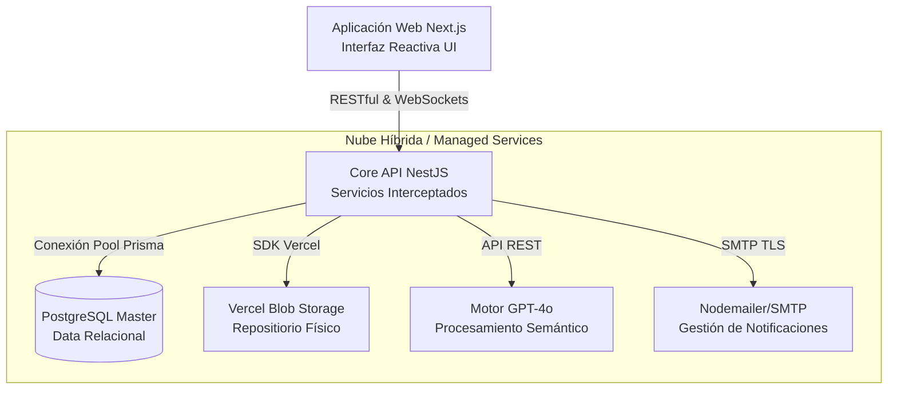

# Arquitectura Técnica y Topología de Despliegue (Praxis Hub)

Este documento define la estructura física y lógica del ecosistema Praxis Hub, garantizando un despliegue escalable, proactivo, trazable y de alta disponibilidad corporativa.

---

## 1. Stack Tecnológico Industrializado (Technology Stack)

El sistema emplea un conjunto de tecnologías de última generación meticulosamente seleccionadas para maximizar la seguridad perimetral, la persistencia de datos relacionales y la mantenibilidad a largo plazo.

| Categoría | Tecnología Empleada | Propósito Arquitectónico y Valor Técnico |
| :--- | :--- | :--- |
| **Backend Core** | NestJS 11+ (Node.js) | El núcleo orquestador. Desarrollado en TypeScript bajo paradigmas de Inyección de Dependencias. Utiliza **Interceptores Globales** y **Filtros de Excepción** para una homogeneidad de API RESTful perfecta. |
| **Frontend Framework** | Next.js 16 (App Router) | Interfaz transaccional (Client/SSR). Emplea `Skeleton Loading` interactivos, renderizado parcial y manejo de vistas Reactivas con Tailwind CSS. |
| **Persistencia ORM** | Prisma 5 | Wrapper de base de datos *Type-Safe*. Garantiza migraciones consistentes de esquema y permite un `Seed` algorítmico avanzado para simulaciones de carga. |
| **Motor Relacional** | PostgreSQL | Almacenamiento maestro de datos (Statefulness). Maneja más de 20 uniones y jerarquías referenciales críticas (*Cascade Deletions*). |
| **Motor de Inteligencia**| OpenAI GPT-4o vía API | Motor de inferencia incrustado asíncronamente en los copilotos y evaluación de reportes de texto (OCR semántico). |
| **Distribución Estructurada**| Vercel Blob Storage | CDN inmutable para almacenamiento descentralizado de documentos PDF, archivos fotográficos y evidencias. Encriptado en reposo. |
| **Transporte de Red** | HTTPS / WebSockets (Socket.io) | Manejo bidireccional seguro (TLS) y tráfico asíncrono para notificaciones In-App en vivo sin cuellos de botella mediante Polling. |

---

## 2. Abstracción del Modelo C4

La separación de preocupaciones (Separation of Concerns) se aplica estructuralmente:

### Contexto (Nivel 1)
Praxis Hub actúa como el "Control Tower" entre sistemas externos (MTA de correos electrónicos, Motores de IA en la nube, Proveedores de autenticación biométrica) y Entidades Reales (Estudiantes, Coordinadores de Carrera, Tutores Académicos y Empresariales). Todo flujo transaccional y de control de estado pasa por validación central.

### Contenedores (Nivel 2)


---

## 3. Arquitectura Lógica Defensiva (Resiliencia)

El backend de Praxis Hub no expone servicios al cliente de manera cruda; requiere transicionar por un **Túnel de Resiliencia**. Cada petición HTTP atraviesa:

1. **Helmet Middleware + CORS Layer:** Filtrado perimetral contra XSS, ataques de enmarcado (Clickjacking) y limitación de agentes remotos.
2. **Passport JWT Auth Guard:** Resolución criptográfica de la sesión (Bearer Token o WebAuthn).
3. **Roles Guard (RBAC):** Una muralla que comprueba recursivamente en base de datos si el JWT decodificado tiene autorización algorítmica para el controlador final.

### El Estándar de Retorno Constante (TransformInterceptor)
Cualquier endpoint que devuelva código 201 o 200, será transformado automáticamente en el servidor para evitar discrepancias que corrompan el parseo del frontend. Esto asegura que _todas_ las respuestas tengan la máscara estructurada: 
```typescript
{
  "success": true,
  "data": { ... payload original ... },
  "timestamp": "2026-06-11T13:42:00.000Z"
}
```

---

## 4. Estrategia del Motor Contextual IA (Hybrid Copilot)

El `AiService` (NestJS) no es un sistema de chat en blanco; su lógica integra un **System Prompt inyectado en tiempo real**. 
Antes de enviar la consulta a OpenAI, el sistema:
1.  Extrae de PostgreSQL el ID del estudiante, las horas validadas, las faltantes y el estado actual de sus documentos obligatorios (e.g. `EN_REVISION_TUTOR`).
2.  Forma el contexto estructurado en formato JSON o texto plano e interpola estas variables.
3.  Envía este bloque como *System Context* al modelo GPT-4o, asegurando un soporte extremadamente preciso y acoplado al expediente del estudiante ("Zero-Hallucination Policy").

---

## 5. Tareas Programadas y Automatización (Cron Jobs)

La salud institucional requiere auditorías automáticas invisibles implementadas mediante el módulo `@nestjs/schedule` que se ejecuta de manera asíncrona:
*   **Garbage Collector (Diario, a las 02:00 AM):** Tarea que limpia archivos huérfanos del almacenamiento temporal de Vercel Blob que nunca fueron formalizados en la base de datos.
*   **Recordatorio de Evaluaciones:** Monitoreo periódico de inactividad que dispara de forma agrupada correos electrónicos automáticos a los tutores empresariales pendientes de calificar prácticas finalizadas.
