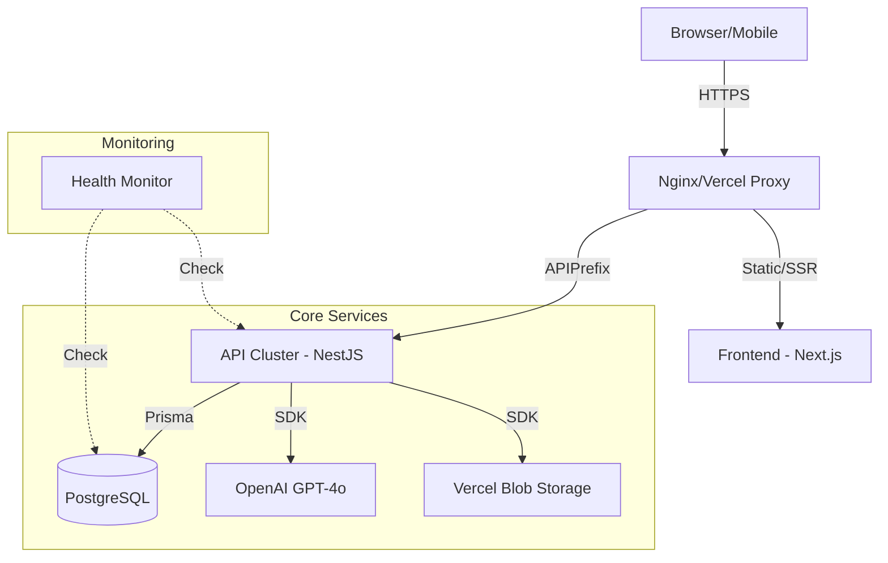

# Arquitectura Técnica y Topología de Despliegue

Este documento define la estructura física y lógica del ecosistema EmiTesis, garantizando un despliegue escalable, proactivo y de alta disponibilidad.

## 1. Stack Tecnológico Industrializado

El sistema emplea un conjunto de tecnologías seleccionadas para maximizar la seguridad, la mantenibilidad y la inteligencia artificial integrada.

| Categoría | Tecnología | Implementación y Valor Técnico |
| :--- | :--- | :--- |
| **IA Engine** | OpenAI GPT-4o | Motor de inteligencia artificial contextual que asiste a los estudiantes en tiempo real basándose en su propio expediente académico. |
| **Backend Core** | NestJS 11+ | Arquitectura modular con **Interceptores de Transformación** y **Filtros de Excepción Globales** para estandarización total de API. |
| **Frontend** | Next.js 16+ | Uso intensivo de **Skeleton Loading** y componentes de alto rendimiento para una UX premium persistente. |
| **Observabilidad** | Custom Health Checks | Monitoreo proactivo de la salud del sistema (DB, AI, Storage) mediante el endpoint `/api/health`. |
| **Seguridad** | WebAuthn / RBAC | Soporte para biometría (simulado/futuro) y control de acceso granular por roles industriales (Admin, Coordinador, Tutor, Estudiante, Empresa). |
| **Almacenamiento**| Vercel Blob | Gestión distribuida de documentos y evidencias fotográficas con alta disponibilidad. |

## 2. Arquitectura de Resiliencia (Lógica)

El sistema implementa un "Core de Resiliencia" que actúa como un sobre protector para todas las transacciones:

### 2.1 Interceptores y Filtros Globales
- **TransformInterceptor**: Envuelve cada respuesta exitosa en un formato estándar `{ success: true, data: T, timestamp: string }`.
- **HttpExceptionFilter**: Intercepta fallos del servidor y los traduce a respuestas JSON amigables, evitando fugas de información técnica (stack traces) hacia el cliente.

### 2.2 Motor de IA Contextual
El `AiService` no es un chatbot genérico; utiliza `gpt-4o` con un **System Prompt dinámico** que inyecta:
- Estado actual de las prácticas del estudiante.
- Conteo de horas y documentos pendientes.
- Contexto de la empresa y tutores asignados.

## 3. Topología de Despliegue (Física)

Mantenemos una arquitectura de contenedores orquestada por Docker para garantizar portabilidad absoluta.

## 4. Gestión de Salud (Observabilidad)

El sistema expone un dashboard de salud técnico (`/api/health`) que verifica:
1.  **Database**: Conectividad y latencia de Prisma.
2.  **AI Service**: Disponibilidad de la API de OpenAI.
3.  **Storage**: Acceso de escritura/lectura al storage de evidencias.

---
Este diseño arquitectónico garantiza que **EmiTesis** pueda escalar para soportar miles de estudiantes simultáneos con una degradación mínima del rendimiento.
