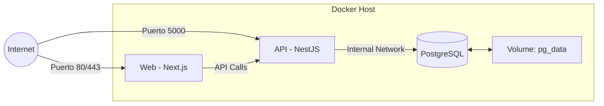

# Arquitectura Técnica y Topología de Despliegue

Este documento define la estructura física y lógica del ecosistema EmiTesis, garantizando un despliegue escalable, portable y de alta disponibilidad.

## 1. Stack Tecnológico y Arquitectura de Decisión

El sistema emplea un conjunto de tecnologías seleccionadas para maximizar la seguridad, la mantenibilidad y la eficiencia en entornos de alta demanda.

| Categoría | Tecnología | Implementación y Valor Técnico |
| :--- | :--- | :--- |
| **Lenguaje** | TypeScript | Garantiza la integridad del código mediante tipado estático, eliminando errores comunes de JavaScript y facilitando refactorizaciones seguras en el futuro. |
| **Frontend** | Next.js 14+ | Se utiliza el App Router y Server Components para optimizar el rendimiento y asegurar una carga de página instantánea mediante Renderizado del Lado del Servidor (SSR). |
| **Backend** | NestJS 11+ | Proporciona una arquitectura modular y escalable, permitiendo una separación clara de responsabilidades y facilitando el crecimiento del sistema sin generar deuda técnica. |
| **ORM** | Prisma | Actúa como el puente seguro entre el código y los datos, automatizando las migraciones y asegurando que el modelo de datos sea siempre consistente. |
| **Base de Datos**| PostgreSQL | Se ha elegido por su robustez transaccional y cumplimiento ACID, asegurando que los registros de prácticas y asistencias sean inmutables y consistentes. |
| **Autenticación**| JWT / Passport | Se implementa una arquitectura sin estado (stateless) para permitir escalabilidad horizontal y reducir la carga sobre la base de datos de sesiones. |
| **Seguridad** | BCrypt / reCAPTCHA | Se utilizan algoritmos de hash de última generación para contraseñas y protección avanzada contra bots en los formularios de acceso. |
| **Infraestructura**| Docker / Compose | Todo el ecosistema está contenerizado para asegurar que el comportamiento sea idéntico en desarrollo y producción, eliminando problemas de entorno. |
| **CI/CD** | GitHub Actions | Se ha automatizado el despliegue para reducir el riesgo humano; cada cambio es validado y auditado antes de ser publicado. |
| **Almacenamiento**| Vercel Blob | La gestión de documentos se realiza en almacenamiento en la nube dedicado, garantizando disponibilidad y rapidez sin saturar el disco del servidor principal. |

## 2. Arquitectura de Infraestructura (Física)

El despliegue se gestiona íntegramente mediante **Docker Composability**.

### 2.1 Orquestación de Contenedores
*   **Multi-Stage Build:** Los Dockerfiles utilizan construcciones multietapa para reducir el tamaño de las imágenes finales (< 200MB).
*   **Healthchecks:** El contenedor de la API espera a que la base de datos esté "Healthy" antes de iniciar el servicio.
*   **Auto-Migración:** Se incluye un script de entrada (`docker-entrypoint.sh`) que ejecuta automáticamente `npx prisma migrate deploy` y `npm run seed`.

## 3. Pipeline de Integración y Despliegue Continuo (CI/CD)

Se utiliza **GitHub Actions** para automatizar el ciclo de vida del software:

1.  **Vigía de Seguridad:** Escaneo de vulnerabilidades mediante `npm audit`.
2.  **Validación de Compilación:** Asegura que tanto el Frontend como el Backend compilen sin errores tras cada commit.
3.  **Registro de Imágenes (GHCR):** Publicación automática de imágenes versionadas en el registro de GitHub tras un push exitoso a la rama `main`.

## 4. Gestión de Configuración y Secretos

El sistema utiliza un modelo de configuración basado en variables de entorno (`.env`):
*   `DATABASE_URL`: Cadena de conexión a PostgreSQL.
*   `JWT_SECRET`: Clave maestra para la firma de tokens.
*   `RECAPTCHA_SECRET_KEY`: Validación con los servidores de Google.
*   `BLOB_READ_WRITE_TOKEN`: Credencial para almacenamiento en la nube.
