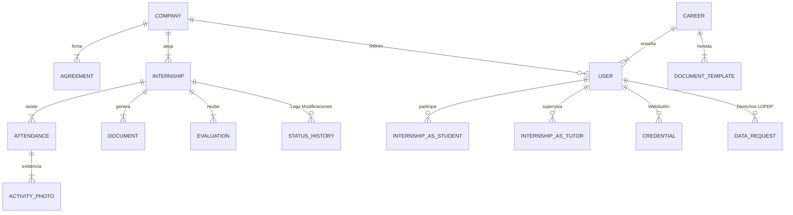

# Base de Datos y Estrategia de Seeding Masivo

Este documento cubre el mapeo transaccional que utiliza Prisma ORM integrado en PostgreSQL para asegurar persistencia y la estrategia de siembra para simulación industrial.

---

## 1. Diseño Entidad-Relación y Estructura Nuclear

El diagrama está optimizado para Normalización 3NF en datos tabulares y denormalización ligera en historiales en volumen (utilizando campos tipo `Json`) para alto rendimiento en lecturas.

---

## 2. Tablas Transversales de Seguridad y Auditoría Operativa

Una aplicación empresarial debe poder trazar el "quién, qué y cuándo" sin necesidad imperativa de revisar backups de base de datos o logs planos del orquestador.

1. **`SystemLog` (Bitácora Maestra):**
   Posee indexación doble `category + createdAt(Desc)` para guardar los milisegundos de consulta, errores fatales, alertas y comportamientos de usuarios del sistema. Es la fuente del "Dashboard de Salud Institucional" para ver peticiones HTTP/500 en vivo.
2. **`EmailLog` (Registro de Fallos de Red):**
   Almacena temporalmente los ecos (Bounce/Bugs) y despachos exitosos asíncronos del Nodemailer, conteniendo qué formato se envió ("EXITO/FALLIDO") asegurando que nadie mienta alegando "no recibí el correo de rechazo".
3. **`InternshipStatusHistory` (Time-Travel Debugging):**
   Graba las mutaciones históricas del estado de la pasantía. (e.g. Cuándo se pasó de "En Proceso" a "Finalizado" y bajo qué Autorizador).
4. **`DataRequest` (Flujo Legal ARCO):**
   Centralización legal en caso de que un estudiante invoque su derecho a que borren toda su data fotográfica y GPS basándose en la normativa LOPDP. 

---

## 3. Gestión Documental Algorítmica

El núcleo de los requisitos es el mapeo entre Formatos Generales e Instanciaciones:

*   **`DocumentTemplate`:** Representa un documento configurado para la Institución o una Carrera (Ej. `F01 - Planilla de Aceptación`). Controla el ordenamiento (Sort Priority), si es obligatorio u opcional y su visibilidad en el ecosistema.
*   **`Document`:** Instanciación física de ese Template, perteneciente al Pasantías del Jugador, acoplado con estados, observaciones e indexación de URLs a Vercel Blob. 
*   **`DocumentComment` / `DocumentVersion`:** Para guardar el historial cuando el tutor se los rechaza y el estudiante hace iteraciones corrigiendo fallos.

---

## 4. Estrategia de Inyección y Simulación ("Master Seeder v11.0")

El archivo `prisma/seeds/seed.ts` no inyecta simplemente 3 usuarios genéricos; utiliza un **algoritmo hiperrealista probabilístico** para pre-llenar postgres. 

El comando `npx prisma db seed` borra de forma segura jerárquicamente la base y reconstruye:
- **50 Estudiantes Modelados Matemáticamente:** 10 asumen escenarios "exitosos", otros 20 escenarios estancados o críticos de plazos vencidos.
- **20 Días de Marcación Simulados:** Distorsiones geomatemáticas y simulacros de fechas de hace 90 días, poblados con URLs de evidencia dummy y fotos random.
- **Purga de Fallos:** Inyección forzada de historiales de error simulados (Logs HTTP 500), Notificaciones (In-App), Mails fallidos y Data Privacy Requests para llenar el panel de administrador y analizar interfaces con data.

Este seeder convierte tu base local en 30 segundos en el equivalente a una plataforma con meses intensos de estrés de producción.
