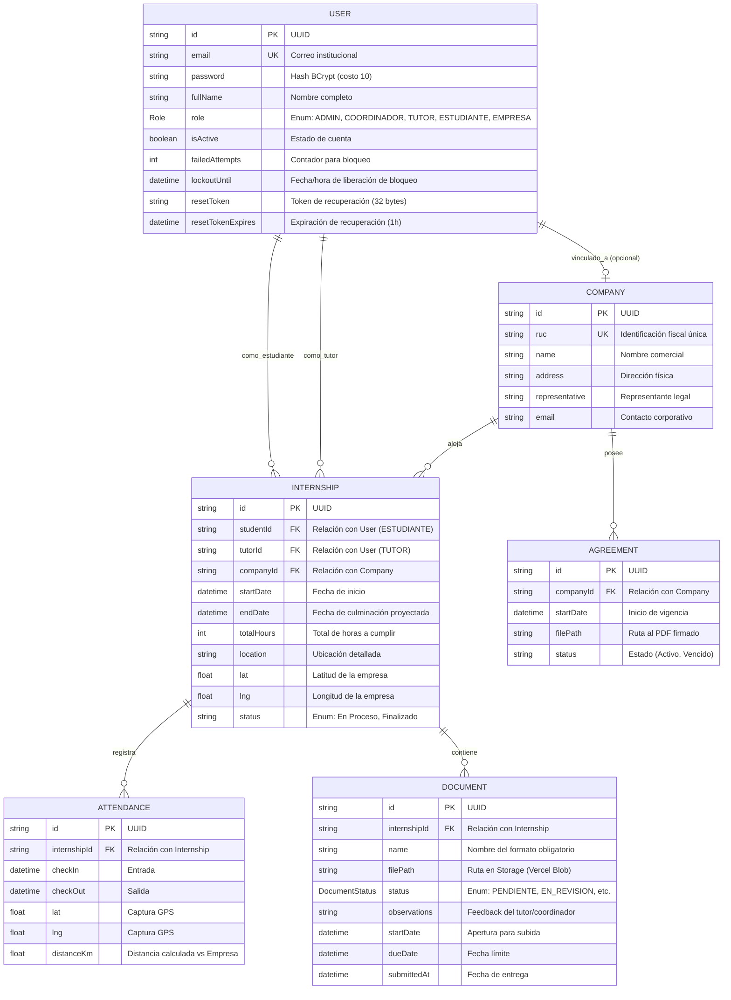

# Diccionario de Datos y Modelo de Entidad-Relación

Este documento proporciona una especificación técnica exhaustiva de la base de datos de EmiTesis, detallando cada entidad, sus atributos, restricciones y el propósito de los campos especiales.

## 1. Diagrama Entidad-Relación Completo (Mermaid)

## 2. Diccionario de Datos: Atributos Especiales

### Gestión de Seguridad (Modelo `User`)
*   `failedAttempts`: Contador incremental que se dispara ante logins fallidos.
*   `lockoutUntil`: Sello de tiempo (Timestamp) que impide el acceso a la cuenta por 15 minutos tras 5 fallos.
*   `resetToken`: Cadena alfanumérica única generada mediante `crypto.randomBytes(32)` para flujos de recuperación.

### Control de Prácticas (Modelo `Internship`)
*   `totalHours`: Horas validadas por el sistema. No se puede cerrar la práctica si las asistencias no cubren el total.
*   `lat / lng`: Almacenan las coordenadas de la empresa para el algoritmo de validación de presencia.

## 3. Consideraciones de Integridad y Rendimiento

El diseño de la base de datos prioriza la consistencia y la seguridad del dato mediante las siguientes estrategias:

1.  **Validación de Tipos (Type Safety):** Gracias al uso de Prisma, el esquema de datos está sincronizado matemáticamente con el código fuente. Esto previene que se almacenen datos inconsistentes o tipos incorrectos, asegurando la calidad de la información desde la raíz.
2.  **Garantía de Relaciones:** PostgreSQL asegura la integridad referencial. Todas las relaciones entre estudiantes, tutores y empresas están estrictamente supervisadas a nivel de base de datos para evitar registros huérfanos.
3.  **Transaccionalidad Atómica:** Operaciones críticas, como la creación de una práctica con sus documentos obligatorios, se ejecutan en transacciones. Esto garantiza que el sistema nunca quede en un estado incompleto si ocurre un fallo.
4.  **Geolocalización Precisa:** El uso de tipos Double Precision para las coordenadas permite una exactitud milimétrica en el cálculo de distancias para el control de asistencia (geofencing).
