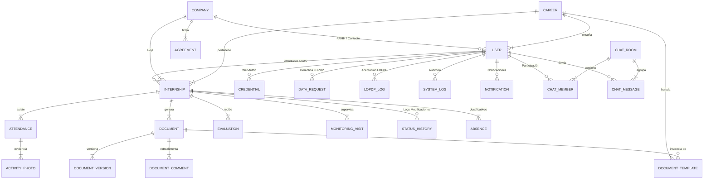

# Base de Datos y Estrategia de Seeding Masivo (Praxis Hub)

Este documento cubre el diseño del modelo entidad-relación transaccional implementado en PostgreSQL utilizando Prisma ORM para asegurar integridad referencial, consistencia de datos relacionales y la estrategia de siembra para simulación industrial.

---

## 1. Diseño Entidad-Relación y Estructura Nuclear

El modelo relacional está optimizado para Normalización 3NF en datos tabulares y denormalización controlada en campos históricos complejos (utilizando el tipo nativo `Json` de PostgreSQL) para alto rendimiento en lecturas de configuraciones y ubicaciones GPS.

---

## 2. Diccionario de Tablas Principales

### A. Núcleo Académico y Estudiantil
*   **`User`:** Contiene los datos principales de los usuarios. Soporta múltiples roles mediante la columna `role` (`ADMIN`, `COORDINADOR`, `TUTOR`, `ESTUDIANTE`, `EMPRESA`). Almacena configuraciones de autenticación de dos factores (2FA), hashes de contraseña (BCrypt), tokens de sesión y estados de privacidad LOPDP.
*   **`Career`:** Define las carreras del ISTPET. Almacena su modalidad oficial y una configuración flexible (`config` tipo `Json`) donde se parametrizan variables dinámicas como la cantidad de horas obligatorias (`requiredHours`).
*   **`Internship` (Pasantías):** Representa la asignación transaccional entre un estudiante, un tutor académico y una empresa. Almacena fechas de inicio/fin, modalidad real de la práctica, datos de contacto del tutor empresarial, coordenadas GPS (`lat`, `lng`) y las ubicaciones de geofencing permitidas (`allowedLocations` tipo `Json`).

### B. Control de Asistencias y Evidencias
*   **`Attendance`:** Bitácora de marcaciones diarias. Guarda las marcas temporales de `checkIn` y `checkOut`, ubicación GPS capturada, desviación calculada (`distanceKm`) respecto al radio de la empresa, descripción de las tareas del día y referencias de fotos de entrada/salida.
*   **`ActivityPhoto`:** Almacena la galería de imágenes cargadas por el estudiante a lo largo del día para validar visualmente sus actividades.
*   **`Absence`:** Justificativos cargados por los estudiantes ante faltas (enfermedad, calamidad doméstica, laboral, etc.), sujetos a revisión y aprobación del tutor académico.

### C. Gestión Documental y Flujos de Aprobación
*   **`DocumentTemplate`:** Catálogo maestro de plantillas documentales configuradas institucionalmente o por carrera (ej. Formulario F01, Plan de Actividades, Ficha de Aceptación).
*   **`Document`:** Instanciación de una plantilla dentro del expediente de una pasantía. Almacena las URLs de Vercel Blob, estados de flujo, fechas límites (`dueDate`), anotaciones de revisión de fragmentos (`reviewAnnotations` tipo `Json`) y las propiedades de firma electrónica (código único de verificación, firma digital y hash).
*   **`DocumentVersion`:** Historial de versiones del documento cargadas por el estudiante tras recibir rechazos del tutor.
*   **`DocumentComment`:** Conversaciones e hilos de retroalimentación técnica entre el estudiante y el tutor sobre el documento.

### D. Evaluación y Monitoreo
*   **`Evaluation`:** Rúbrica de calificación dual (`ACADEMICA` y `EMPRESARIAL`) que evalúa puntualidad, proactividad, trabajo en equipo, habilidades técnicas y actitud.
*   **`MonitoringVisit`:** Registro formal de visitas físicas o virtuales realizadas por el tutor académico a la empresa, incluyendo observaciones y carga de evidencias.

### E. Seguridad, Auditoría y Cumplimiento Legal
*   **`SystemLog`:** Registro persistente de transacciones HTTP, duración de peticiones, códigos de estado, direcciones IP y correos de actores para auditoría técnica en tiempo real.
*   **`LopdpLog`:** Registro inmutable de la aceptación de términos y políticas de protección de datos (LOPDP) de cada usuario.
*   **`DataRequest`:** Flujo formal de ejercicio de derechos ARCO (Acceso, Rectificación, Cancelación y Oposición) presentados por los usuarios.
*   **`UserCredential`:** Llaves criptográficas y contadores del estándar WebAuthn (Passkeys) asociados a los usuarios.
*   **`EmailLog`:** Trazabilidad de correos electrónicos despachados y fallidos (Bounce logs).
*   **`SystemSetting`:** Configuración dinámica del comportamiento del sistema (módulos SMTP, límites de radio GPS y umbrales de reCAPTCHA).

### F. Módulo de Comunicación Interactiva
*   **`ChatPermission`:** Tabla de permisos que restringe qué roles pueden escribirse entre sí (ej. Estudiante $\leftrightarrow$ Tutor).
*   **`ChatRoom`, `ChatRoomMember`, `ChatMessage`:** Estructura relacional para mensajería interna instantánea 1:1 o grupal entre los participantes de una práctica, con soporte para borrado por LOPDP.

---

## 3. Estrategia de Inyección y Simulación ("Master Seeder v11.0")

El archivo `prisma/seeds/seed.ts` implementa un **algoritmo hiperrealista probabilístico** para poblar PostgreSQL local o entornos de staging/QA en segundos.

### Acciones del comando `npm run setup` / `npx prisma db seed`:
1.  **Limpieza Jerárquica:** Borra en orden de cascada todas las tablas relacionales para evitar colisiones de llaves primarias o restricciones de integridad.
2.  **Configuración Base:** Crea las carreras académicas (ej. Ciberseguridad, Desarrollo de Software), plantillas documentales oficiales y roles principales.
3.  **Generación de 50 Estudiantes Simulación:** Modela matemáticamente tres perfiles de estudiantes:
    *   **Escenario Exitoso (20%):** Prácticas completas, documentos aprobados, evaluaciones duales excelentes y asistencias con geofencing perfecto.
    *   **Escenario Crítico (30%):** Estudiantes con marcaciones con alertas GPS (fuera del radio de tolerancia), documentos rechazados por mala redacción o plazos vencidos, y solicitudes de justificación de ausencias pendientes.
    *   **Escenario en Progreso (50%):** Progreso activo con bitácoras diarias variadas, chats iniciados y retroalimentación interactiva en proceso.
4.  **Simulación de 20 Días de Operación:** Genera datos históricos con fechas pasadas, calculando geolocalizaciones reales alrededor de las sedes corporativas con ruidos geométricos realistas, inyectando fotos dummy de evidencias y logs de auditoría (SystemLog, EmailLog) para llenar los tableros del Administrador.
