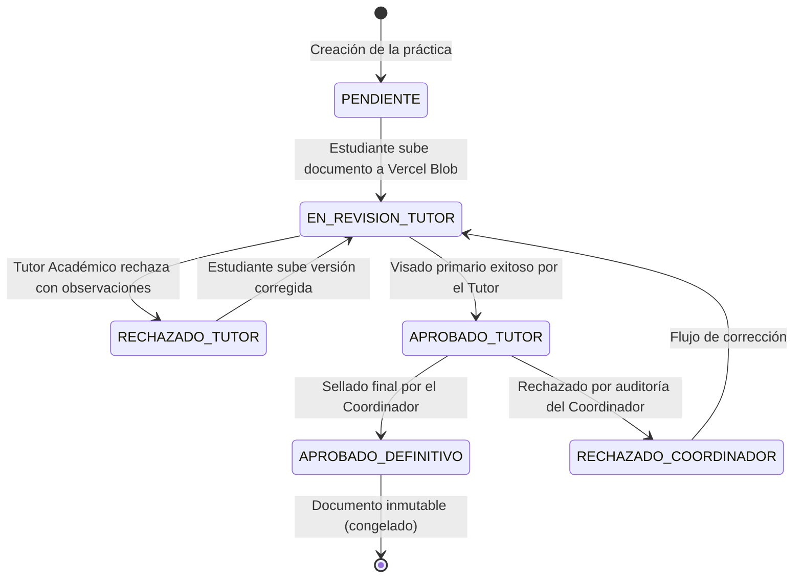

# Lógica de Negocio y Reglas de Control (Praxis Hub)

Este documento detalla las normativas de validación y las máquinas de estado que estructuran el ecosistema Praxis Hub, previniendo errores de proceso y forzando el cumplimiento de la calidad académica en cada práctica.

---

## 1. El Ciclo de Vida Secuencial de las Prácticas

El ecosistema obliga a que las prácticas preprofesionales transicionen por un flujo secuencial sin saltos de fase. Si una fase se retrasa, el resto del ciclo queda pausado algorítmicamente.

### Fase I: Asignación e Inicialización
Toda práctica debe ser oficialmente registrada por un **Coordinador** antes de ser operada.
*   **Convenio Activo Obligatorio:** La asignación exige que la empresa vinculada posea un convenio (`Agreement`) en estado "Activo" y con cupos disponibles (`maxInterns`). Un convenio caducado bloquea automáticamente la asignación de nuevos pasantes.
*   **Horas Requeridas:** La carrera asociada al estudiante determina dinámicamente (`Career.config`) la meta mínima de horas de la práctica (típicamente 160 o 240 horas).

### Fase II: Marcaje Diario de Asistencias (Geofencing y Evidencias)
Módulo diario a cargo exclusivo del **Estudiante**.
*   **Cálculo GPS (Fórmula de Haversine):** Al registrar una marcación (Check-In o Check-Out), el backend captura las coordenadas GPS (`lat/lng`) enviadas por el dispositivo móvil y calcula la distancia con respecto a la sede de la empresa:
    $$d = 2R \arcsin\left(\sqrt{\sin^2\left(\frac{\Delta \text{lat}}{2}\right) + \cos(\text{lat}_1)\cos(\text{lat}_2)\sin^2\left(\frac{\Delta \text{lng}}{2}\right)}\right)$$
    Si la distancia supera el radio de tolerancia permitido (definido dinámicamente por la empresa, ej. 200 metros), la marcación registra una advertencia geográfica o es rechazada según la política configurada.
*   **Autenticación Biométrica (WebAuthn):** El sistema permite exigir que el marcaje diario se firme mediante huella digital o reconocimiento facial en dispositivos compatibles.
*   **Evidencias Diarias:** Es mandatorio adjuntar una foto de trabajo (`ActivityPhoto`) y una descripción detallada de actividades para que la jornada sea contabilizada como válida.

### Fase III: Evaluación Dual de Cierre
El fin de una práctica exige una evaluación en dos frentes:
*   **Tutor Empresarial (`EMPRESARIAL`):** Califica el desempeño corporativo del estudiante en campo (puntualidad, proactividad, trabajo en equipo, habilidades técnicas y actitud) en una escala numérica del 1 al 5.
*   **Tutor Académico (`ACADEMICA`):** Califica la calidad técnica de la documentación cargada en el expediente.
*   **Consolidación:** Ambas rúbricas alimentan un gráfico de rendimiento visual para que el Coordinador valide el cumplimiento antes de la aprobación final.

---

## 2. Flujo Documental y Máquina de Estados (State Machines)

Los documentos tienen vida propia a través de un **Flujo de Bloqueo de Nodos (Cascade Approval)**.

### Protocolo de Inmutabilidad Documental
Cualquier documento transicionado al estado `APROBADO_DEFINITIVO` es congelado por el backend. Cualquier petición posterior de borrado (`DELETE`) o edición (`PUT`/`PATCH`) sobre dicho archivo o sus metadatos es rechazada con un código HTTP `403 Forbidden`, garantizando la inalterabilidad de los expedientes oficiales.

---

## 3. Alertas y Tareas Programadas (CRON)

*   **Límites de Plazo (`dueDate`):** Cada documento obligatorio tiene una fecha límite configurada.
*   **Notificaciones Proactivas:** Con 48 horas de anticipación a la fecha de vencimiento, el sistema dispara notificaciones internas (`InAppNotification`) y correos automáticos al estudiante si el documento sigue en estado `PENDIENTE`.
*   **Cierre Automático por Inactividad:** Si se vence el plazo y el estudiante no ha presentado evidencias de marcación en la práctica durante un periodo prolongado, el sistema genera alertas de abandono de práctica para investigación.

---

## 4. Salvaguardas del Agente IA (Zero-Hallucination Guardrails)

El widget de Copiloto de IA proporciona un soporte personalizado pero seguro:
1.  **Aislamiento Contextual (Pre-Prompts):** El backend inyecta los datos cuantitativos y cualitativos exactos del estudiante (horas acumuladas, plantilla de documentos rechazados, etc.) como contexto inmutable en la petición.
2.  **Zero-Hallucination Guardrails:** El prompt del sistema prohíbe de forma estricta al modelo de lenguaje (GPT-4o) inventar reglamentos internos del ISTPET. El asistente debe responder exclusivamente con base en las directrices institucionales que han sido interpoladas en su contexto activo.
