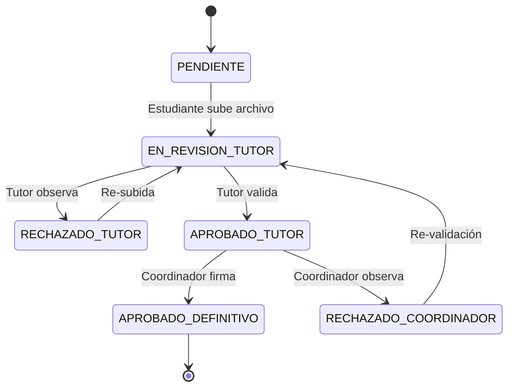

## 1. Diseño del Ciclo de Vida de la Práctica

El proceso está gobernado por tres entidades principales: Estudiante, Tutor Académico y Representante de la Empresa. El flujo ha sido diseñado para maximizar la transparencia y el control administrativo.

### 1.1 Control de Asignaciones y Validaciones
Para garantizar la integridad del proceso académico, se han implementado las siguientes validaciones automáticas:
*   **Exclusividad Académica:** El sistema impide que un estudiante sea asignado a más de una práctica simultánea en estado activo, evitando duplicidad de horas y conflictos administrativos.
*   **Vigencia Institucional:** Solo se permite el inicio de prácticas con empresas que posean un convenio vigente en la base de datos, asegurando el respaldo legal de cada pasantía.
*   **Control de Tiempos:** Se ha restringido la creación de asignaciones con fechas pasadas para mantener una cronología auditada y real del proceso.

### 1.2 Inicialización de Documentación Obligatoria
Al momento de oficializar una práctica, el sistema instancia automáticamente el set completo de 8 documentos requeridos por la normativa de la institución. Esto elimina el error humano de olvido de formularios y asegura que el estudiante tenga su expediente listo desde el primer día.
1. Solicitud de prácticas.
2. Plan de rotación.
3. Informe de actividades.
4. Registro de asistencia.
5. Evaluación del tutor académico.
6. Evaluación del representante de la empresa.
7. Informe final de prácticas.
8. Certificado de culminación.

## 2. Gestión Documental y Firma Electrónica

### 2.1 Flujo de Revisión (State Machine)
Los documentos siguen un flujo jerárquico estricto de aprobación:

### 2.2 Restricciones Temporales
*   **Disponibilidad:** Los formatos para descarga solo son visibles si la fecha actual es mayor o igual a `startDate`.
*   **Bloqueo de Edición:** Una vez que un documento alcanza el estado `APROBADO_DEFINITIVO`, el sistema bloquea cualquier intento de actualización de archivos o metadatos.

## 3. Control de Asistencia mediante Geofencing

El sistema implementa una validación física del estudiante en el sitio de práctica:
1. **Captura:** Al realizar Check-In/Check-Out, se capturan las coordenadas GPS desde el cliente.
2. **Cálculo:** Se aplica la fórmula de Haversine para determinar la distancia entre el estudiante y el centro de práctica registrado.
3. **Registro de Desviación:** Si la distancia excede el margen permitido (ej. 500m), el registro se marca con una advertencia en el reporte del tutor.

## 4. Sistema de Notificaciones Automáticas
El módulo `EmailService` dispara eventos inyectados de forma asíncrona:
*   **Bienvenida:** Registro de empresa exitoso.
*   **Asignación:** Notificación al estudiante con detalles de la empresa y horas.
*   **Alertas:** Documentos próximos a vencer o rechazados.
