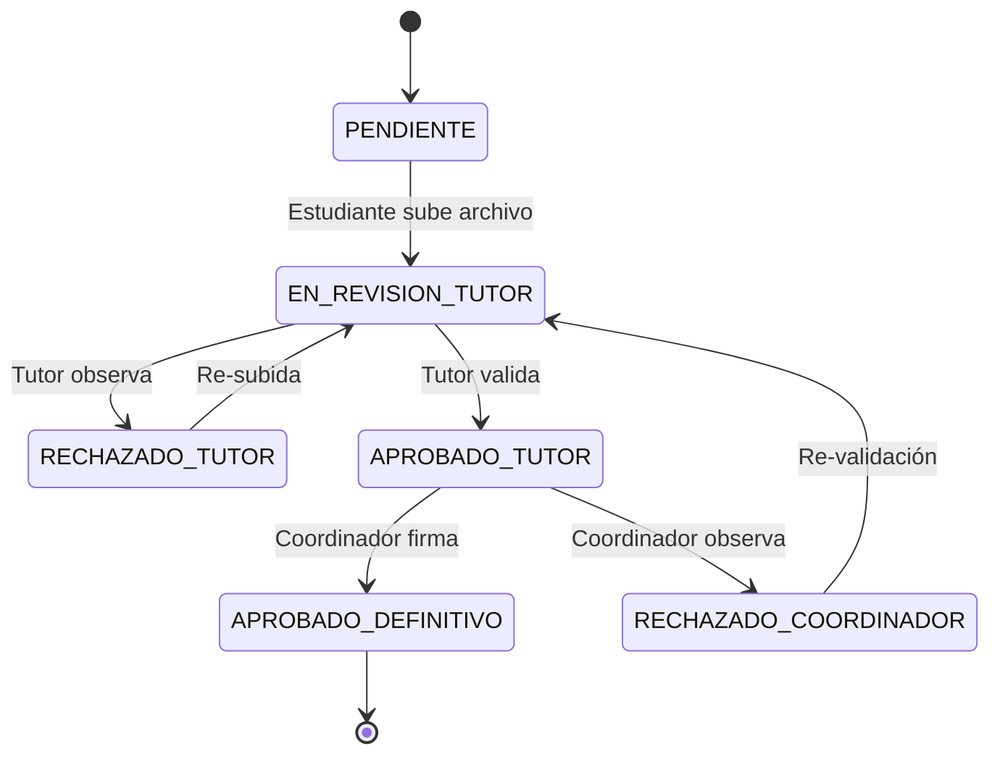

# Lógica de Negocio y Reglas Técnicas

Este documento detalla las reglas de nivel industrial que gobiernan el comportamiento del ecosistema EmiTesis, asegurando la calidad académica y el cumplimiento normativo.

## 1. Ciclo de Vida del Estudiante (Roadmap Industrial)

El proceso de prácticas se ha gamificado y estandarizado en 4 etapas críticas:
1.  **Asignación**: Vinculación de estudiante-tutor-empresa.
2.  **Ejecución (Marcaje 360)**: Registro diario de asistencia con validación de geofencing (GPS) y biometría.
3.  **Monitoreo y Evidencia**: Subida obligatoria de fotos de actividades diaria para validación por parte del tutor empresarial.
4.  **Evaluación y Cierre**: Generación de certificado tras cumplir el 100% de horas y aprobaciones.

## 2. Reglas de Validación de Asistencia (RF-ATT-LOC)

- **Geofencing**: El sistema valida que el estudiante se encuentre dentro de un radio de **X metros** (configurable por locación) de los puntos permitidos definidos por la empresa.
- **Biometría Progresiva**: Si el dispositivo lo permite, se solicita validación biométrica para evitar el "marcaje por terceros".
- **Evidencia Visual**: No se permite cerrar una jornada de asistencia sin la carga de al menos una **foto de actividad** que demuestre el trabajo realizado ese día.

## 3. Modelo de Evaluación Dual (RF-07)

A diferencia de sistemas tradicionales, EmiTesis emplea un modelo de evaluación cruzada:
- **Evaluación Empresarial**: Enfocada en aptitudes técnicas, proactividad y actitud en el entorno laboral.
- **Evaluación Académica**: Enfocada en el cumplimiento de los objetivos de aprendizaje y la calidad de los informes entregados.
- **Dual Performance Glance**: Los coordinadores pueden ver ambos puntajes lado a lado para detectar discrepancias en el rendimiento.

## 4. Inteligencia Artificial Contextual (AI Copilot)

The system uses AI for autonomous technical support:
- **Zero-Hallucination Policy**: La IA solo responde basándose en el expediente actual del estudiante y las reglas de negocio del ISTPET.
- **Asistencia Proactiva**: Identifica documentos faltantes o proximidad a la finalización de horas para alertar al estudiante.

## 5. Protocolo de Monitoreo 360 (Tutor Académico)

- **Visitas de Campo**: Los tutores académicos deben registrar al menos una visita de monitoreo presencial o virtual, documentando evidencias en el sistema.
- **Alertas Tempranas**: Si un estudiante deja de marcar por más de 3 días hábiles, el sistema genera una alerta crítica para el tutor académico.

---
Estas reglas garantizan que el título de técnico/tecnólogo esté respaldado por un proceso de prácticas verificable y de alta calidad.

### 2.1 Flujo de Revisión (State Machine)
Los documentos siguen un flujo jerárquico estricto de aprobación:

### 2.2 Restricciones Temporales
*   **Disponibilidad:** Los formatos para descarga solo son visibles si la fecha actual es mayor o igual a `startDate`.
*   **Bloqueo de Edición:** Una vez que un documento alcanza el estado `APROBADO_DEFINITIVO`, el sistema bloquea cualquier intento de actualización de archivos o metadatos.

## 3. Control de Asistencia mediante Geofencing

El sistema implementa una validación física del estudiante en el sitio de práctica:
1. **Captura:** Al realizar Check-In/Check-Out, se capturan las coordenadas GPS desde el cliente.
2. **Cálculo:** Se aplica la fórmula de Haversine para determinar la distancia entre el estudiante y el centro de práctica registrado.
3. **Registro de Desviación:** Si la distancia excede el margen permitido (ej. 500m), el registro se marca con una advertencia en el reporte del tutor.

## 4. Sistema de Notificaciones Automáticas
El módulo `EmailService` dispara eventos inyectados de forma asíncrona:
*   **Bienvenida:** Registro de empresa exitoso.
*   **Asignación:** Notificación al estudiante con detalles de la empresa y horas.
*   **Alertas:** Documentos próximos a vencer o rechazados.
