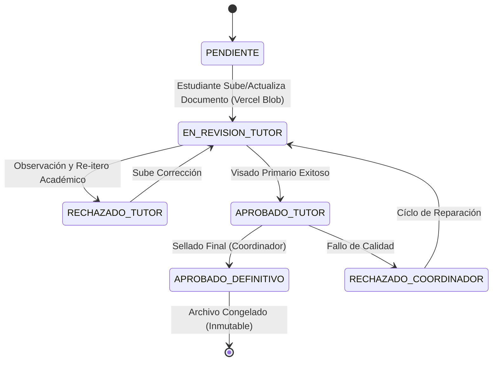

# Lógica de Negocio y Reglas Institucionales Industriales

Este documento detalla las normativas inviolables ("Hard-Rules") y máquinas de estado que estructuran el ecosistema EmiTesis, previniendo errores humanos y forzando el cumplimiento de la calidad académica.

---

## 1. El Ciclo de Vida Secuencial de Pasantías

El ecosistema obliga a que los 6 actores pasen por un _Roadmap_ sin excepciones de salto de fase. Si una fase se retrasa, el resto del ciclo (incluyendo la graduación) queda pausado algorítmicamente.

### Fase I: Asignación e Inicialización (`Start-Offset`)
Toda práctica debe ser oficialmente asignada por un **Coordinador** antes de ser operada.
*   **Aprobación del Convenio:** La asignación exige matemáticamente que la empresa vinculada posea un convenio (`Agreement`) con estado "Activo". Un convenio caduco detiene el sub-módulo de asignación para todos sus estantes.
*   **Targeting de Horas:** La carrera (e.g. Ciberseguridad, Desarrollo de Software) determina directamente (`requiredHours`) mediante un `JSON` en la base de datos el target mínimo requerido, usualmente 160 o 240 horas.

### Fase II: Marcaje 360 y Cumplimiento Geofencing
Módulo diario y repetitivo a cargo exclusivo del `ESTUDIANTE`.
*   **Radio GPS:** A través de la fórmula *Haversine*, el marcaje intercepta las coordenadas. Todo registro a una lejanía superior a la establecida (X metros de tolerancia fijada en la base de datos) es bloqueado por el cliente, catalogado o vetado.
*   **Seguimiento Biométrico Inyectado:** Una credencial de huella virtual u OIDC (WebAuthn) se demanda si el dispositivo es capaz, para mitigar completamente los "falsos check-in".
*   **Fotos Evidenciales Obligatorias:** Un marcaje sin una foto de trabajo (ActivityPhoto) impide que se procese la jornada como válida.

### Fase III: Máscara Multidimensional de Evaluación (Performance Dual)
El fin de una práctica exige una revisión matemática dividida:
*   **Tutor Empresarial (`EMPRESARIAL`):** Califica aptitud corporativa, proactividad y trabajo en equipo del estudiante `[Escala Absoluta Numérica]`.
*   **Tutor Académico (`ACADEMICA`):** Califica la concordancia y calidad técnica de los documentos `[DocumentTemplates]`.
*   **Dashboard Visual:** El coordinador analiza ambas métricas. Diferencias abismales alertan por bandera investigativa.

---

## 2. Documentación Restringida y Máquina de Estados (State Machines)

Los documentos ya no son estáticos; tienen vida propia a través de un **Flujo de Bloqueo de Nodos (Cascade Approval)**.

**Restricción Crucial (`Immutability Protocol`):**
Cualquier documento PDF que ingrese algorítmicamente en el estado `APROBADO_DEFINITIVO` se sella. Los Delete requests provenientes del front-end o los Update requests son desechados (HTTP 403 Forbidden). Esto garantiza la preservación legal.

---

## 3. Disparadores Automáticos y Control de Hilos

### "Email Queue" y Cronómetro de Vencimiento
Cada documento posee implícitamente variables `startDate` (Fecha de Inicio) y `dueDate` (Fecha Límite). 

*   **Advertencia Amarilla:** Inyección proactiva de recordatorios `InAppNotification` y alertas de correo cuando el `dueDate` se acerca a su ventana final (-48h).
*   **Tolerancia Cero (Timeout Action):** Si el cronómetro finaliza y el estudiante no subió la evidencia, la base de datos lanza un estado de rebote de plazos mediante un Job Automatizado (`@Cron`).

---

## 4. Agente IA (Zero-Hallucination Guardrails)

El soporte interno del sistema se maneja enteramente mediante Inteligencia Artificial.
1.  **Contextualización Pre-Ejecución:** En lugar de lanzar un modelo general de IA y "ver qué pasa", NextJS inyecta el estado logístico exacto del estudiante (p.ej.: "Faltan 16 horas y el Formulario F02 fue rechazado").
2.  **Anti-Alucinaciones:** El system prompt instruye obligatoriamente evitar inventar normativas. Únicamente puede utilizar los protocolos de graduación inyectados en la memoria temporal activa de la plataforma.
